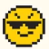
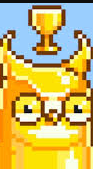
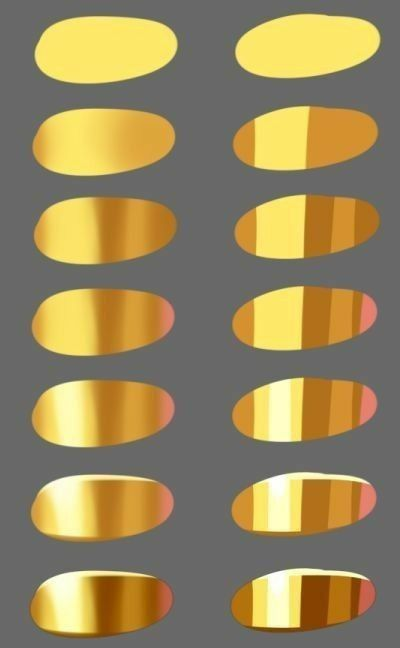
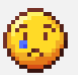
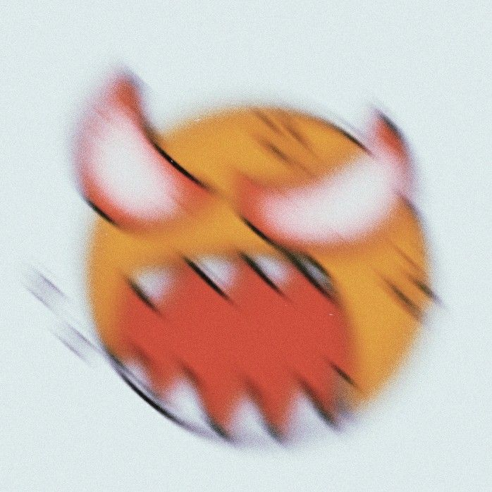

# 表情包绘制项目

# 任务描述

> 2025-12-25 前完成千万发送量回馈表情专辑，基于 乱动像素猫Ver2 中中发送量中发送量最高的「emm」 作为基础绘制八张动图。

使用 Aseprite Previewer 来预览表情在微信中的大概效果

# 短期目标

* 确定当前要绘制的剩余内容的表现形式（拼贴参考原型草稿）
* 整理近期采集素材

## 采集相关经验

* 搜索「微信表情 审核时间 坑 经验」（小红书看起来相关经验会更多）

## 关键词

> 感觉用得上的

nft(e.g. 杀手女友系列？) shader

# 表情规划

> 考虑的是绘制基于base底模的基础上绘制八款不同含义的表情包。例如同一个动作不同情绪，通过装饰物和纹理等方式来表达情绪而不是通过修改底模

## base

* shape: base
* style: none
* motion: base
* fx: none
* emotion: common
* text: emm

晃耳朵、眨眼、对手指

## joker

* shape: base
* style: 小丑面部装饰
* motion: base
* fx: none
* emotion: common
* text: oh

> 当前差异有点不明显，如果能用shader套一下可能会好一点

## shining

* shape: base
* style: gold skin
* motion: base
* fx: shining
* emotion: cool
* text: hh

## sad

* shape: base
* style: tear
* motion: base
* fx: none
* emotion: cool
* text: sad

## tired

* shape: base
* style: coffe + 黑眼圈
* motion: base
* fx: none
* emotion: tired
* text: umm

## chill

* shape: base
* style: none
* motion: base
* fx: 果冻摇晃
* emotion: chill
* text: uwu

## angry

* shape: base
* style: coffe + 黑眼圈
* motion: base
* fx: 红温
* emotion: angry
* text: sii

## happy

* shape: base
* style: shining eye, 腮红
* motion: base
* fx: 冒爱心
* emotion: angry
* text: sii

